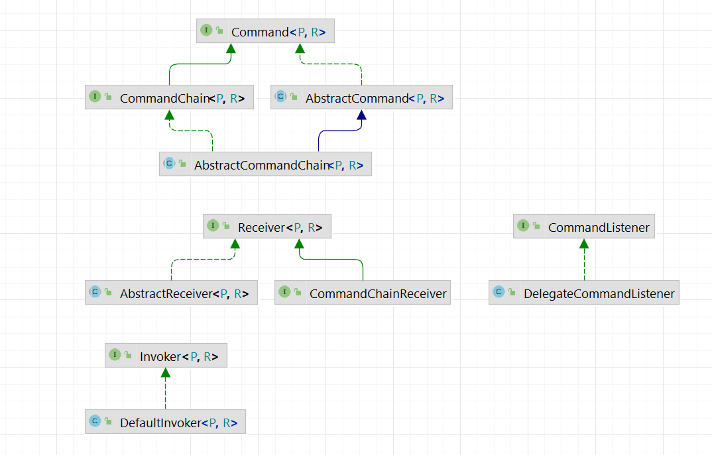

# Command Gateway

## Especificação

### Command Pattern

> "Encapsulate a request as an object, thereby letting you parameterize clients with different
requests, queue or log requests, and support undoable operations."  
(Gamma et al. Design Patterns)

### Objetivo 

O objetivo desta biblioteca é disponibilizar uma estrutura leve para criar aplicações com baixo acoplamento e altamente testáveis.  
A sua principal característica é uma implementação do padrão de comandos, que permite que a aplicação execute operações sem prévio conhecimento sobre onde ou como a sua solicitção será executada.  
Usar comandos faz com que seja mais fácil construir componentes gerais que precisam delegar, sequenciar ou executar métodos num momento da sua escolha, sem a necessidade de conhecer a classe do método ou os seus parâmetros.  

## Modelo

### [Command](src/main/java/br/com/b1g/command/common/command/Command.java)

Comandos são a unidade mínima de processamento de regra de negócio.  
Encapsulam e padronizam a passagem dos parametros e obtenção dos resultados nas diversas rotinas que o sistema deve executar para atender aos requisitos do negócio,
disponibilizando uma ‘interface’ comum a todas as classes concretas que a implementam.

#### Implementações

> [AbstractCommand](src/main/java/br/com/b1g/command/common/command/impl/AbstractCommand.java)  
> Classe base para a implementação de comandos.

### [Command Chain](src/main/java/br/com/b1g/command/common/command/CommandChain.java)

Uma command chain descreve uma sequência de comandos executados pelo sistema permitindo compor operações de negócio mais complexas.  
O seu método `invoke` permite configurar e realizar chamadas a outros comandos ou mesmo outras command chains e tratar os seus resultados. 

#### Implementações

>[AbstractCommandChain](src/main/java/br/com/b1g/command/common/command/impl/AbstractCommandChain.java)  
>Classe base para a implementação de casos de uso.

### [Receiver](src/main/java/br/com/b1g/command/common/command/Receiver.java)

O receiver tem o conhecimento necessário para poder executar a solicitação, porém externamente os objetos não sabem quais ações são executadas, eles apenas visualizam o método execute() que irá executar as suas solicitações.  
Desta forma, todos os clientes de objetos command tratam cada objeto como uma "caixa preta", simplesmente invocando o método execute() sempre que o cliente exige "serviço" do objeto.  
Os receivers são, na implementação dessa biblioteca, preferencialmente, funções puras e singletons, sendo assim possível utilizar a mesma instancia do receiver para atender a todas as chamadas de determinado comando.  
É possível associá-los aos seus respectivos comandos através do ReceiverResolver.  

#### Implementações

> [AbstractReceiver](src/main/java/br/com/b1g/command/common/command/impl/AbstractReceiver.java)  
>Classe base para a implementação de casos de receptores.

### [ReceiverResolver](src/main/java/br/com/b1g/command/common/gateway/ReceiverResolver.java)

O ReceiverResolver atua como um registro onde é possível vincular o comando ao receiver responsável por executar as suas soluicitações.  
O método `bind` é responsável por associar uma classe de comando ao uma instância de Receiver compatível.
O método `resolve` é responsável recuperar o receiver associado a um determinado de comando.

#### Implementações

> [DefaultReceiverResolver](src/main/java/br/com/b1g/command/common/gateway/impl/DefaultReceiverResolver.java)  
> Permite a associação entre as classes de comando e o seu receptor.

>[ApplicationContextAwareReceiverResolver](src/main/java/br/com/b1g/command/common/gateway/annotation/ApplicationContextAwareReceiverResolver.java)  
> Escaneia o contexto de aplicação e registra automaticamente os receivers anotados com [@CommandReceiver](src/main/java/br/com/b1g/command/common/gateway/annotation/CommandReceiver.java) 

### [Command Gateway](src/main/java/br/com/b1g/command/common/gateway/CommandGateway.java)

O CommandGateway é responsável por expor aos componentes externos do sistema uma maneira uniforme de invocar comandos ou cadeias de comandos.  
Ele atua como um invocador genérico, configurando a chamada de cada comando com os parametros informados e o receiver resolvido pelo ReceiverResolver.

